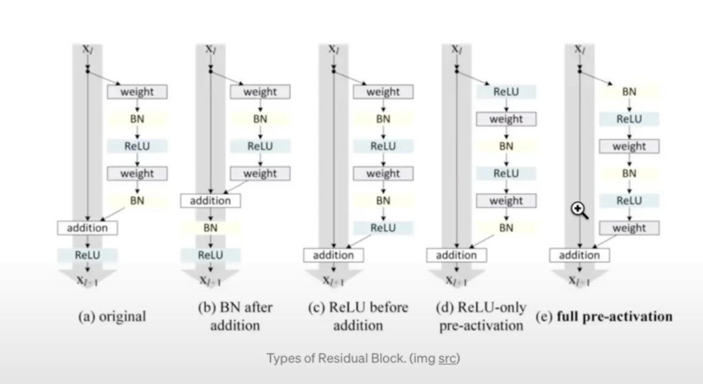
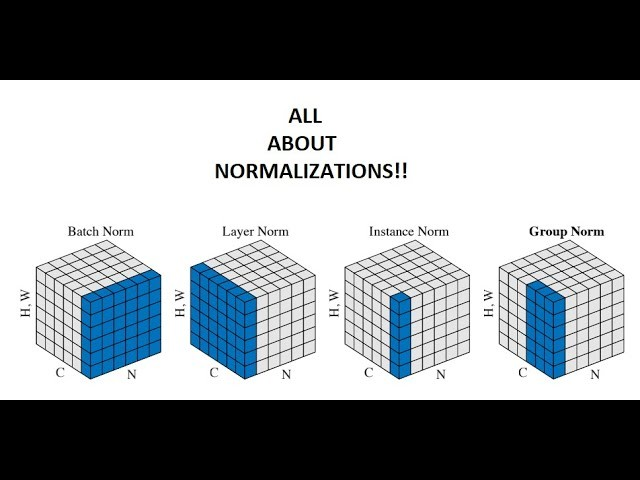
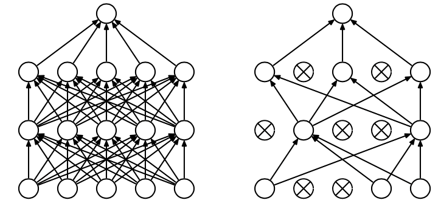
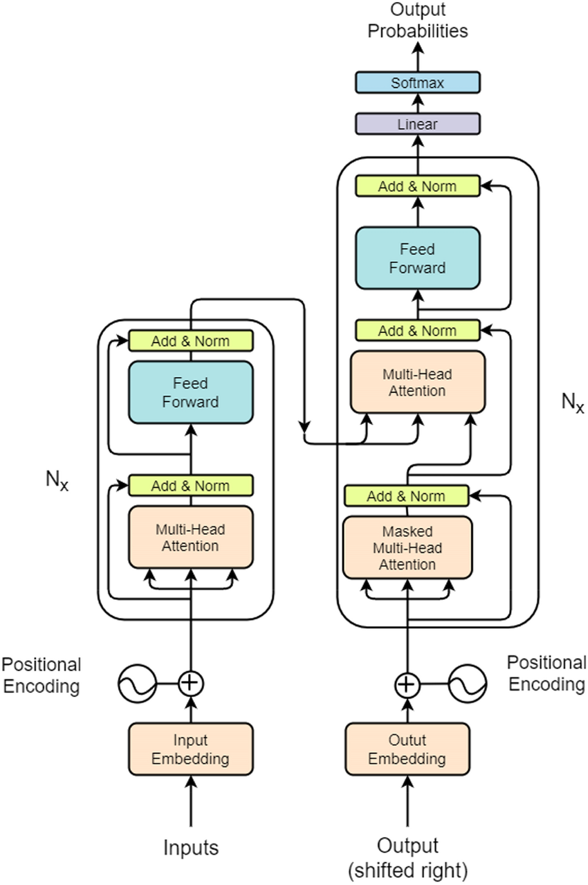

Tokenizers:
SentencePiece
TikToken

We can tradeoff the codebook size and the sequence length.
We can have very long sequences of integers with very small vocabularies.
or we can have short sequences of integers with very large vocabularies.

Input to Model:

Time Dimension:
The way transformer's train
We can create multiple samples out of one sample.
Let us say our sample contains 5 tokens in total [1, 2, 3, 4, 5]
This could be a total of 4 samples for our transformer model.
How?
[1] can be used to predict 2
[1, 2] can be used to predict 3
[1, 2, 3] can be used to predict 4
[1, 2, 3, 4] can be used to predict 5

The training of these mini-samples within a sample is also independent for each minisample

Batch Dimension:
As we are sampling these chunks of text
We are going to have mini-batches of multiple chunks of texts
which are all stacked up into a single tensor
this is for efficiency, just to keep the gpus easy
Very good at parallel processing of data
But these chunks are processed completely independently
i.e. they don't talk to each other.

Arrangement of Dimensions for Cross Entropy
The torch functional cross-entropy function
expects the channels to be the second Dimension
The way in which our logits will be generated is (B, T, C)
B: Batch Dimension
T: Time Dimension
C: Channels showing how likely a certain character is to follow a given character.

So we need to reshape our logits to properly fit the cross_entropy format of inputs.

Initial Loss:
With 65 characters in vocab:
We are expecting a loss of -ln(1 / 65): 4.87

How to use mps:
device = "mps" if torch.backends.mps.is_available() else "cpu"
model.to(device)
Seems useless as code runs slower on mps than on cpu.
Check what is happening.

Mathematical trick in self-attention
The tokens should only flow from previous context to the current time-step
We cannot get any information from the future because we want to predict the future.

Every single node or token at each position
will emit two vectors
Key and Query
Query : What am i looking for
Key : What do i contain

Affinities / Attention = Dot product between keys and queries.

My query dot products with all the keys of all the other tokens.
If key and queries are aligned then we get to learn more about the token with that specific key

If I am the fifth node, I don't want to gather information
from the sixth, seventh and eighth node and this is the reason behind
masking

One more part to the self attention head

We also have a value vector
v = Value(x)
k = key(x)
q = key(x)

out = wei @ v

x can be thought as the private information to every token
for the purposes of this single head
q -> here is what i am interested in
k -> here is what i have
v -> If you find me interesting, here is what i will communicate to you

Notes on Attention:
First
It is a communication mechanism
A number of nodes in a directed graph
Every node has some vector of information
and it gets to aggregate information via a weighted sum
from all of the nodes that point to it.
Done in a data dependent manner, so depending on the data
that is actually stored in the node at each point of time.

In principle, attention can be applied to any arbitrary directed graph.

Second
Attention has no notion of space
It simply acts over a set of vectors
Hence, we need positional encoding.

This is different wrt convolution. Convolutional filters act in space.

Third
The elements across the batch Dimension
which are independent examples
never talk to each other

Fourth
In case of llm, future tokens do not talk to past tokens.
But that is not necessarily the case.
Eg. Sentiment Analysis.
In this specific case, you will use an encoder block of the transformer
For llms we only use the decoder block

Fifth
Cross-Attention and Self Attention

Self-Attention:
K, Q, V come from the same source (x)

Cross-Attention:
Q come from (x)
K, V come from a whole separate source (y) (Could be the encoder block)

Sixth:
Scaled Dot-Product
Why multiply by 1 / sqrt(head_size)

It is important normalization to have

It is important that wei be fairly diffused during normalization

Becasue of softmax, if wei takes very +ve or -ve numbers inside it
softmax will actually converge to one-hot vectors

Multi-Head Attention
It is just applying
multiple attentions in parallel
and then concatenating their results

Concatenate over the channel Dimension
The head_size needs to be adjusted
Let us say we have 4 heads
Let us say over original communcating channels were 32
So now 4 each head we will have 8 communicating channels => 32 // 4
They will concatenate to give 32 -> n_embd
It helps to have multiple independent communication channels
because the tokens have a lot to talk about

Feed Forward Networks
It is a simple MLP
Adds computation into the network
The computation is at a per node level

If this part is missing. (i.e. if only attention blocks are present without FF)
You can think of this as the tokens did look at each other
But didn't really have enough time to think on what they found in other tokens.

Communication - Done using Multi-Headed Attention
Computation - Done using FeedForward Networks
Now keep doing this N number of times (This will create a deep neural network)

Optimization Issues:
It becomes considerably harder to train deep neural networks
as we run into Optimization issues.

There are 2 techniques that dramatically help with deep networks Optimization

1. Residual Connections
2. LayerNormalization

## Residual Connections:

You transorm the data
But then you have a skip connection
With addition
from the previous features

The way to visualise it is as following

Here computation happens from top to bottom
You have this residual pathway
You can fork off from the residual pathway, perform some computation and
project back to the residual pathway via addition
and so you go from the inputs to the targets
only via plus (addition)
and the reason this is useful is if we remember
from micrograd
during backpropagation
Addition distributes gradients equally to both of its branches which are fed as input
So the gradients from the loss basically hop through every addition node all the way to the input while also forking off into the residual blocks.

Basically you have this gradient super-highway which
goes directly from the supervision (loss) all the way to the input unimpeted.

Residual blocks are ususally initialised in the beginning such that they contribute very very little if anything to the residual pathway.

But during the optimization, the residual blocks come online and start contributing and kick in.

This dramatically helps with the optimization.

## Layer Normalization

Very similar to BatchNormalization

You can think of it this way.

Instead of normalizing the cols.
We will normalize the rows.

We don't need the buffers as in bn
No distinction between training and test time as in bn
We don't need momentum as in bn
We do need gamma and beta for obvious reasons.

Here are some basic types of norms:

**Note:** Very few details about the transformers have changed over the years but the way in which ln is implemented is one of those changes.

Deviation from the original paper (attention is all you need):
Add and norm is applied after transformation
Now it is a bit more common to apply ln
before the transformation

These modifications help more and more as the networks get deeper

## Adding Dropout

Dropout takes your neural net
and randomly every forward backward pass
shuts off some subset of neurons
and trains without them
and what this does effectively is
because the mask of what is being dropped out
is changed every single fw, bw pass
it ends up kind of training an ensemble of sub-networks
and then at test time everything is fully enabled and all of the sub-networks are kind of merged into a single ensemble

This can be seen as a regularization technique
Can be useful when you want to scale up a model and are concerned about overfitting.
Read the paper in detail (Interesting)

## Encoder and Decoder Implementations

We have a decoder only transformer architecture as we are just generating text and it is unconditioned on anything.

What makes it a decoder is that we are using the triangular mask, which gives it the auto-regressive property.

The original paper was a machine-translation paper.

Eg. French - to - English translation

Original Architecure

Cross-Attention:
If we want to condition the generation on some additional information.
Then we need to use the encoder blocks.
We feed the additional information to the encoder.
There is no triangular mask here.
Once encoding is done.
The keys and values can be used from the encoder
while the queries come from the decoder.

**Note** We can treat the heads as the fourth-dimension. Creating nice batches.

## ChatGPT

What would it look like if we wanted to train ChatGPT ourselves?
How does it relate to what we learned?

Roughly 2 stages:
Pre-training (What we have done. Get a GPT to babble internet). IT ONLY BABBLES INTERNET!!!
Fine-tuning: Align it to be an assistant

Roughly three steps

- Collect demonstration data and train a supervised policy
- Collect comparison data and train a reward model. Let the model respond and different raters rate the output providing a reward model.
- Optimize a policy against the reward model using the PPO reinforcement learning algorithm.

It also has multiple steps in between there

This takes the model from being a document completer or internet babbler
To a
Question Answerer

This data is not available publicly and is internal to OpenAI and it is much harder to replicate their results hence.
